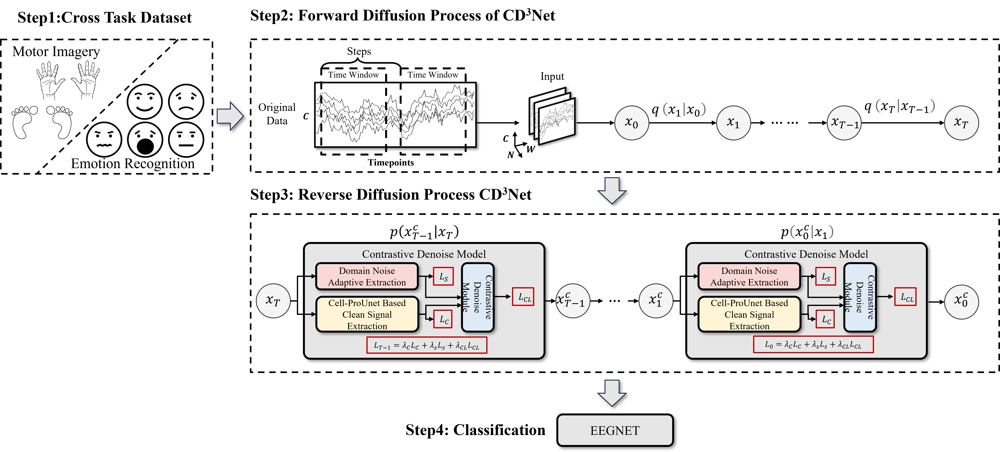

# CD3NET
This is the code implementation for the paper CD3Net. The code is being actively maintained, and the required dependencies for reproducing the project have already been provided in the requirements.txt.

